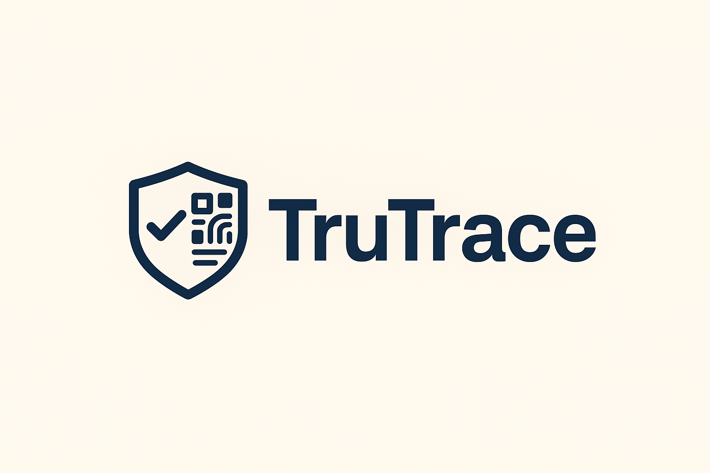

# TruTrace

Verifying Real-World Value, One Authentic Asset at a Time.



## Overview

TruTrace is a decentralized protocol that leverages AI and blockchain to create an unforgeable record of authenticity and provenance for physical assets. It allows anyone to verify a luxury item's history and legitimacy with a simple video scan from their smartphone.

## How It Works

1.  **Scan:** A user scans an item using the TruTrace mobile app.
2.  **Analyze:** Our on-device AI model analyzes the item's unique physical characteristics to generate a cryptographic hash ("Asset DNA").
3.  **Verify & Record:** The hash, along with metadata, is recorded on the Solana blockchain, updating the asset's Dynamic NFT.
4.  **Explore:** Anyone can view the asset's full, transparent history by scanning its tag or looking up its NFT.

## Project Structure

This repository is a monorepo containing the following packages:

*   `/contracts` - Solana smart contracts written in Rust using the Anchor framework.
*   `/app` - Cross-platform mobile application built with Flutter.
*   `/model` - Training scripts and data for our TensorFlow AI model.
*   `/web` - A simple web explorer to view asset histories.

## Installation & Local Development

### Prerequisites

- Node.js (v18+)
- Rust & Cargo
- Solana CLI tools
- Flutter SDK
- Python 3.9+
- Git

### 1. Clone the Repository

```bash
git clone https://github.com/your-organization/trutrace.git
cd trutrace
```

### 2. Setting up the Smart Contracts
```bash
cd contracts
anchor build
anchor deploy
```

### 3. Setting up the Mobile App
```bash
cd ../app
flutter pub get
flutter run
```

*(See individual package READMEs for detailed setup instructions.)*

## Usage
1. For Users: Download the app, create a wallet, and start scanning items. Verify your own items to build their provenance.
2. For Brands: Contact us to integrate our SDK into your production and sales pipeline.
3. For Developers: Use our public API to query asset provenance or build your own applications on the TruTrace protocol.

## Links
- X (Twitter): [@GauravKara_Koti](https://x.com/GauravKara_Koti)
- Discord: [@smol.pepe](https://discord.gg/smol.pepe)

## Acknowledgments
- Thanks to the Solana and Anchor communities for their excellent tooling and support.
- This project was initially conceptualized for the Crypto's Got Talent (CGT) competition.
